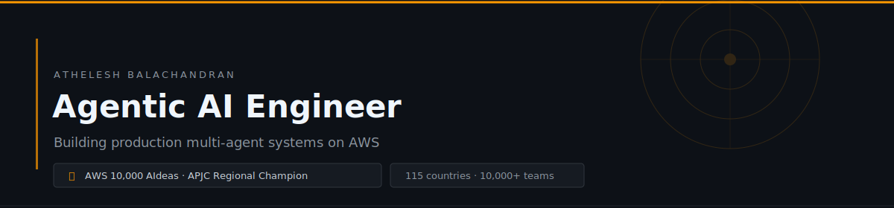

---

**Building production-grade agentic AI systems on AWS.**  
Final-year EEE student · Solo builder · AWS APJC Regional Champion

---

## 🏆 Recognition

**AWS 10,000 AIdeas — APJC Regional Champion** · April 2026

Selected from 10,000+ teams across 115 countries through four elimination rounds. One of 20 global winners from 50 finalists — the only participant from Tamil Nadu. Joint media feature with **Jeff Barr** (VP & Chief Evangelist, AWS) via Business Today. Invited to showcase at **AWS re:Invent, Las Vegas**.

→ [AWS Builder Center article](https://builder.aws.com/content/3AzrKpJbhJwEP6EZbm87vdxufgi/aideas-finalist-veloquity-the-agentic-evidence-intelligent-platform-turning-raw-feedback-into-evidence-driven-decisions)

---

## What I Build

I design and deploy multi-agent systems where multiple AI agents work in parallel, each with a specific role, producing outputs that are confidence-scored, source-traced, and auditable — not black-box summaries.

The pattern across everything I build:
- **Deterministic eval pipelines** — scoring formulas in code, LLM narrates but never decides
- **Production constraints** — cost per run, latency, automated tests, domain-agnostic validation
- **Real failure mode thinking** — parallel agent race conditions, Lambda quota limits, VPC connectivity, cold start behaviour under load

---

## Featured Work

| Project | What it does | Stack | Links |
|---|---|---|---|
| **Veloquity** | Multi-agent evidence intelligence platform. Ingests fragmented feedback, clusters semantically, scores confidence, outputs source-traced decisions. Validated across SaaS + healthcare with identical pipeline. **$0.029/run · 91s · 158 tests.** AWS APJC Championship winner. | Lambda · Bedrock · pgvector · Nova Pro | [Demo](https://youtu.be/wEG5jTQxlJ4) · [Article](https://builder.aws.com/content/3AzrKpJbhJwEP6EZbm87vdxufgi/aideas-finalist-veloquity-the-agentic-evidence-intelligent-platform-turning-raw-feedback-into-evidence-driven-decisions) · 🔒 Private |
| **Magnivonic** | Two-tier 6-agent org intelligence platform. 4 parallel domain agents → Chief of Staff → General Manager. Dual relational + vector memory. Real GitHub API + Slack webhooks. Neural voice output. Built in 4 days. Currently in active judging — H0: Hack the Zero Stack (AWS × Vercel). | Lambda · Aurora Serverless v2 · pgvector · Polly | [Demo](https://youtu.be/yHm4YSJl2-k) · [Article](https://builder.aws.com/content/3CPrQNB11R9JUMP9XPZxUvwuUIu/magnivonic-the-organizational-intelligence-layer-for-the-enterprise-or-h0-hack-the-zero-stack-with-vercel-v0-and-aws-databases) · [Repo](https://github.com/Athelesh-7G/MAGNIVONIC) |
| **Edge AI Predictive Maintenance** | End-to-end fault detection pipeline on Raspberry Pi. FFT feature engineering on vibration signals → tuned Random Forest → 93% accuracy across mechanical + electrical fault classes. Sub-second on-device inference. | Raspberry Pi · Python · scikit-learn · FFT | — |

> Veloquity is private to protect proprietary architecture. The AWS Builder Center article and demo video cover the system in full.

---

## Stack

| Layer | Technologies |
|---|---|
| **Agentic AI** | Multi-agent orchestration · LLM tool use · RAG · pgvector/HNSW · Confidence scoring · Eval pipelines |
| **Cloud** | AWS Lambda · Amazon Bedrock · Aurora Serverless v2 · S3 · EventBridge · Amazon Polly · IAM |
| **Languages** | Python · TypeScript · C++ · SQL |
| **Frontend** | React · Next.js · Tailwind CSS · Vercel |
| **Models** | Amazon Nova Pro · Titan Embed V2 · YOLOv8 · FaceNet |

---

## Stats

---

## Currently

- 📍 Final year, B.E. EEE — PSG Institute of Technology and Applied Research, Coimbatore
- 🔨 Targeting AI/cloud engineering roles at top product companies
- 📚 DSA daily in C++ · System design · OS · DBMS · CN

---

The most significant work lives in private repos. The public record is the tip.

